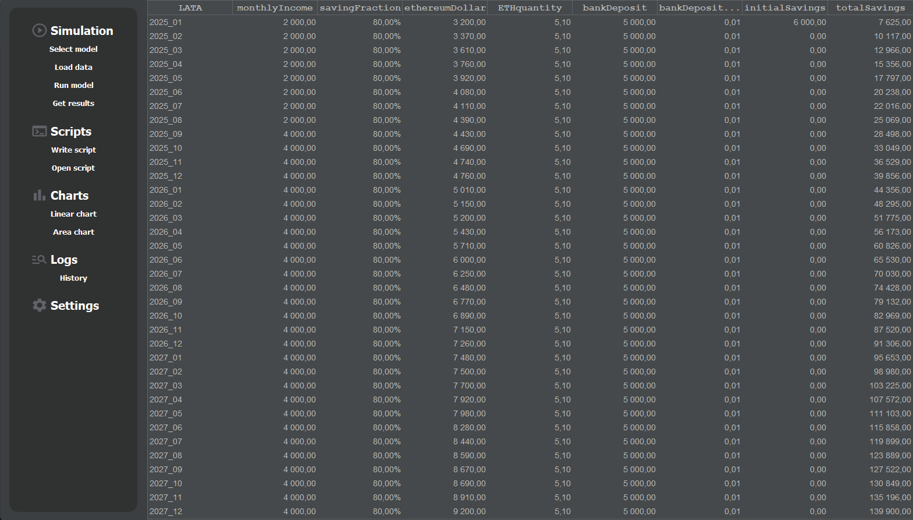
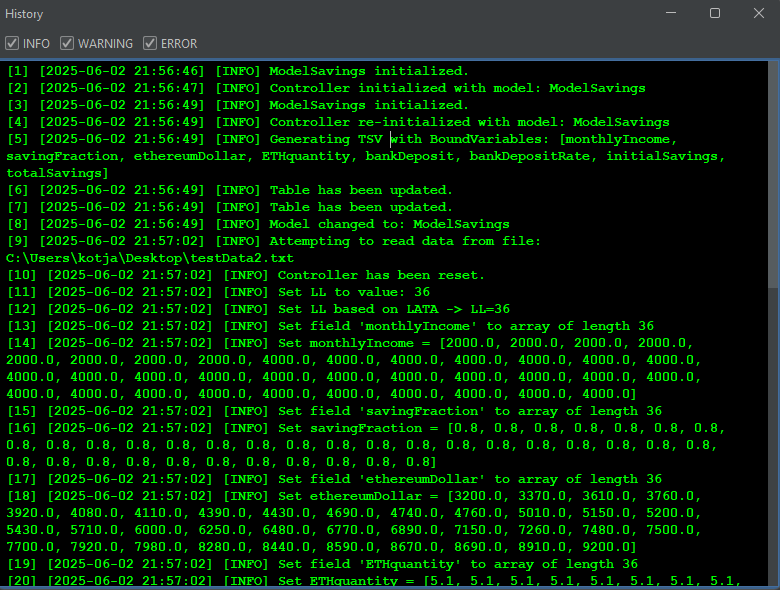
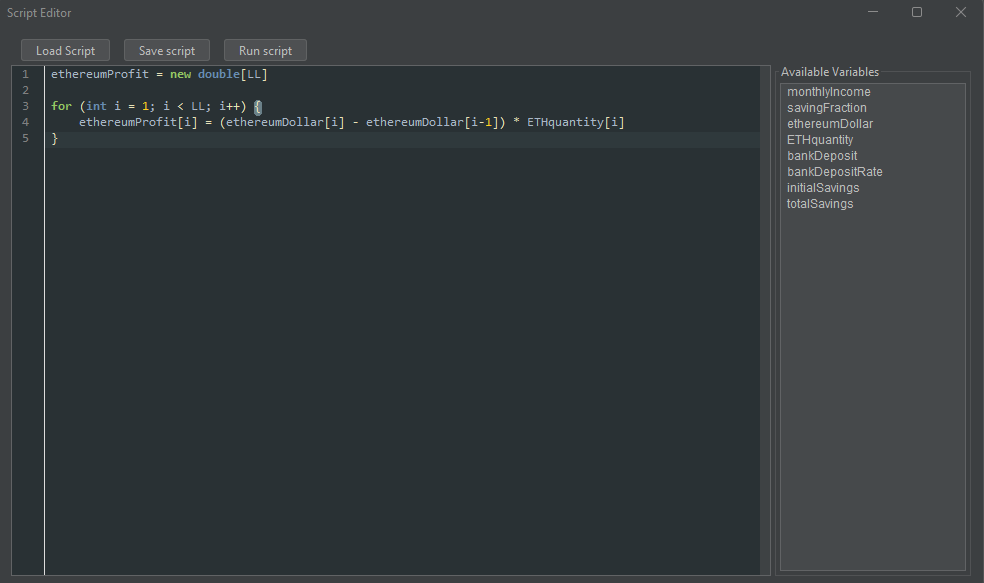
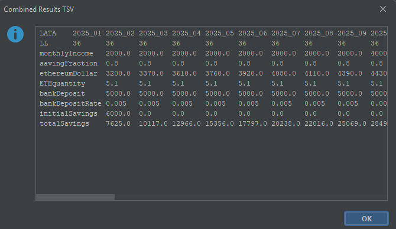
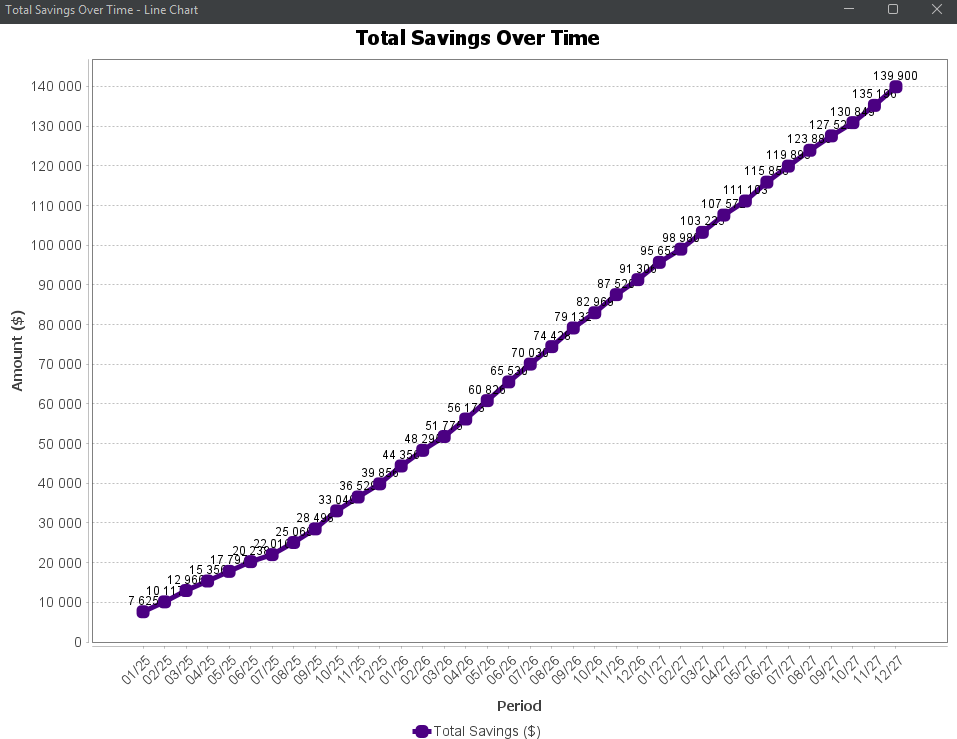
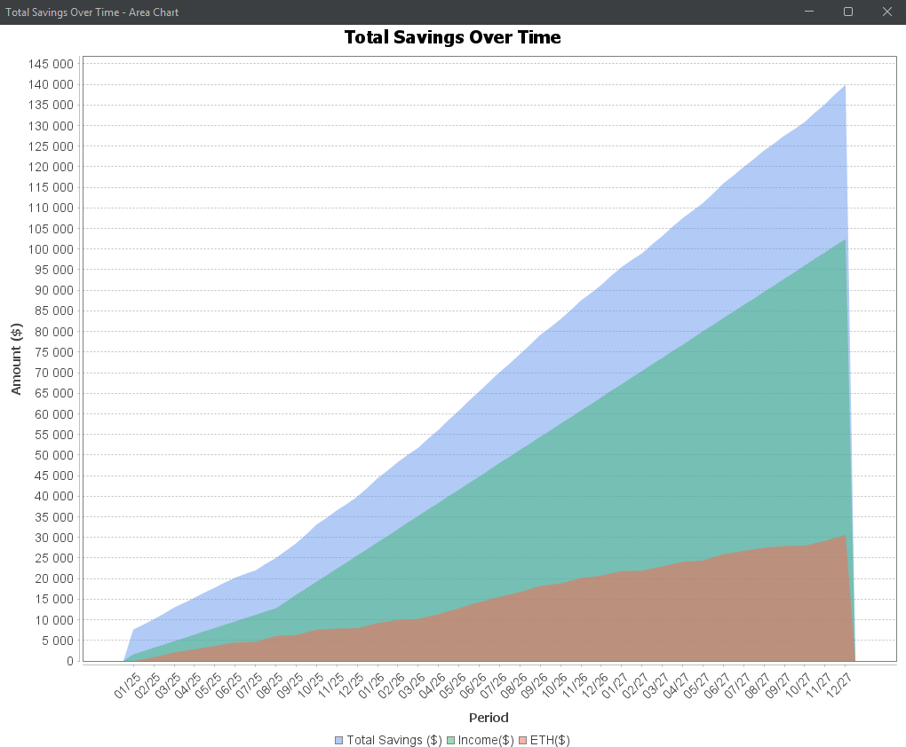

# Savings-Simulator v1.0





## Table of Contents

1. [🔎 Project Overview](#1-project-overview)  
2. [🧠 Features](#2-features)  
3. [⚙️ Tech Stack](#3-tech-stack)  
4. [🧱 Architecture & Components](#4-architecture--components)  
5. [📦 Installation & Usage](#5-installation--usage)  
6. [🧪 Running Scripts](#6-running-scripts)  
7. [📤 Exporting Results](#7-exporting-results)  
8. [📊 Charts & Visualization](#8-charts--visualization)  
9. [📁 File Format & Data Loading](#9-file-format--data-loading)  
10. [🗺️ Roadmap](#10-roadmap)  


## 1. 🔎 Project Overview

**Savings Simulator v1.0** is a local Java-based application designed to help users **understand, simulate, and optimize their financial future**.  

By combining income, bank interest, and cryptocurrency dynamics, it enables realistic modeling of savings growth across time.  

Whether you're tracking stable deposits or exploring volatile assets like Ethereum, this tool empowers you to **plan with data, test custom strategies, and build financial awareness** — all in a clear, interactive environment.

## 2. 🧠 Features

- Load simulation data from `.txt` files  
- Visualize savings with **line and area charts**  
- Built-in **Groovy script editor** with syntax highlighting  
- Real-time **log viewer** with filtering (INFO / WARNING / ERROR)  
- Dynamic model switching and flexible architecture  
- Stylish GUI with **FlatLaf dark theme**



---

## 3. ⚙️ Tech Stack

| Layer         | Technology                  |
|---------------|-----------------------------|
| Language      | Java 21 (LTS)               |
| GUI           | Java Swing + FlatLaf        |
| Charts        | JFreeChart                  |
| Scripting     | Groovy 4.x                  |
| Editor        | RSyntaxTextArea             |
| Logging       | Custom log viewer           |

> 📦 Required `.jar` libraries must be downloaded manually. See [5. Installation & Usage](#5-installation--usage).

---

## 4. 🧱 Architecture & Components

| Component            | Description                                                   |
|---------------------|---------------------------------------------------------------|
| `MainGUI`           | Central class; builds layout and handles navigation           |
| `ModelSavings`      | Main simulation logic combining ETH, income, bank savings     |
| `Controller`        | Manages data loading, script execution, and binding           |
| `ChartManager`      | Generates line and area charts                                |
| `ScriptEditorWindow`| Syntax-highlighted script editor for Groovy                   |
| `HistoryWindow`     | Scrollable, filterable log window (INFO / WARNING / ERROR)    |
| `NavigationPanel`   | Sidebar navigation panel with rounded button styling          |

---

## 5. 📦 Installation & Usage

1. Clone the repository:
   ```bash
   git clone https://github.com/jkot16/savings-simulator.git
   ```
2. Download and place the following .jar files in: resources/jars/
  - FlatLaf 3.5.4
  - Groovy 4.0.24
  - JFreeChart 1.5.3
  - RSyntaxTextArea 3.5.3

3. Run MainGUI.java to launch the application.

> 💾 Sample input data for `ModelSavings` is available in the [`sampleData`](sampleData/) folder for quick testing.
---

## 6. 🧪 Running Scripts

- **Scripts > Write Script** – opens the built-in script editor panel (with syntax highlighting)  
- **Scripts > Open Script** – lets you select a `.groovy` file from your computer and **immediately executes** it if valid

**Language:** Groovy  
All `@Bind` variables from the simulation model are accessible and editable.

✅ Example script:
```groovy
incomeSavings = new double[LL]
for (int i = 0; i < LL; i++) {
    incomeSavings[i] = savingFraction[i] * monthlyIncome[i]
}
```

After execution, your custom variables are available for visualization and further computation.


---
## 7. 📤 Exporting Results

Use **Scripts > Get Results** to retrieve simulation output directly as tab-separated values.  
Ideal for direct pasting into Excel, Google Sheets, or any spreadsheet tool for further analysis.



## 8. 📊 Charts & Visualization

Available under **Charts > Linear chart** or **Area chart**

- **Line Chart**: Displays total savings over time  
- **Area Chart**: Cumulative visualization of income, ETH profit, and total savings  
- Powered by **JFreeChart** with custom rendering and stylization
  



---

## 9. 📁 File Format & Data Loading

**Input:** `.txt` file with tab-separated values  
**Example structure:**

```plaintext
LATA              2025_01   2025_02   2025_03
monthlyIncome     2000      2000      2000
savingFraction    0.8       0.8       0.8
ethereumDollar    3000      3100      3200
ETHquantity       5.1       5.1       5.1
```

Each row represents a variable; values are automatically bound to the simulation model.  
⚠️ If any input is incomplete, the last known value is repeated (fallback).

---

## 10. 🗺️ Roadmap


---
## 📎 Icons & Assets

This project uses icons from [Google Material Icons](https://fonts.google.com/icons), licensed under the [Apache License 2.0](https://www.apache.org/licenses/LICENSE-2.0).
